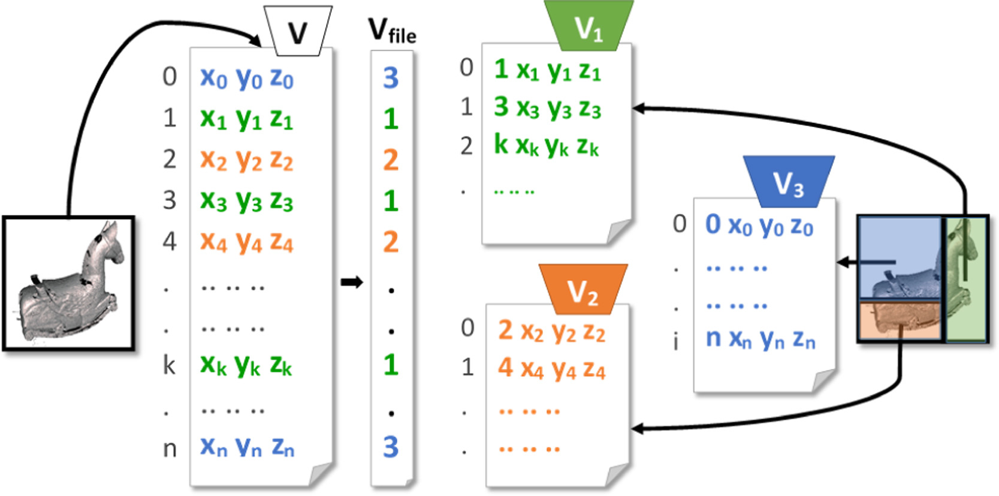

# OOCTriTile

OOCTriTile is an out-of-core (OOC) method to split trimeshes into smaller tiles, according a user-defined size (in terms of numebr of vertices per tile).

<p align="center"></p>

## What is in
OOCTriTile is provided as a collection of folders:
* *examples*: standalone applications to be used as an example of OOCTriTile usage
* *external*: externel dependencies, provided as git submodules
* *include*: main source code, provided as a header-only C++ library

## How to get it
Please, use --recursive when cloning this repository.

`git clone --recursive https://github.com/DanielaCabiddu/OOCTriTile`

## How to make it work
OOCTriTile is provided as a header-only library, included into the *include* folder. To include OOCTriTile in your project, simply include the *include* folder in your code.

To build example applications included into the *examples* folder, use CMake.

## Authors
* Daniela Cabiddu (CNR IMATI), Marco Attene (CNR IMATI)
  
## Citing us
OOCTriTile is described into a journal paper (https://doi.org/10.1016/j.cag.2015.05.015, Sez 3.1).
If you use OOCTriTile in your academic projects, please consider citing it using the following BibTeX entry:

```bibtex
@article{CABIDDU201581,
title = {Large mesh simplification for distributed environments},
journal = {Computers & Graphics},
volume = {51},
pages = {81-89},
year = {2015},
note = {International Conference Shape Modeling International},
issn = {0097-8493},
doi = {https://doi.org/10.1016/j.cag.2015.05.015},
url = {https://www.sciencedirect.com/science/article/pii/S009784931500062X},
author = {Daniela Cabiddu and Marco Attene},
keywords = {Indexed mesh, Out-of-core, Big data, Parallel algorithm},
abstract = {An algorithm is described to simplify arbitrarily large triangle meshes while leveraging the computing power of modern distributed environments. Our method combines the flexibility of out-of-core (OOC) techniques with the quality of accurate in-core algorithms, while representing a particularly fast approach thanks to the concurrent use of several computers in a network. When compared with existing parallel algorithms, the simplifications produced by our method exhibit a significantly higher accuracy. Furthermore, when our algorithm is run on a single machine, its speed is comparable with state-of-the-art OOC techniques, whereas the use of more machines enables relevant speedups. Noticeably, we observe that the speedup increases as the size of the input mesh grows.}
}
```

## Acknowledgements
This work is partly supported by the EU FP7 Project no. ICT-2011-318787 (IQmulus) and by the international joint project on “Mesh Repairing for 3D Printing Applications” funded by Software Architects Inc (WA, USA). The authors are grateful to all the colleagues at IMATI for the helpful discussions.
